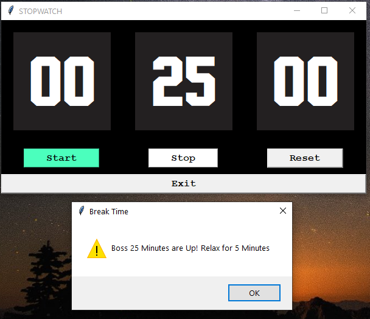
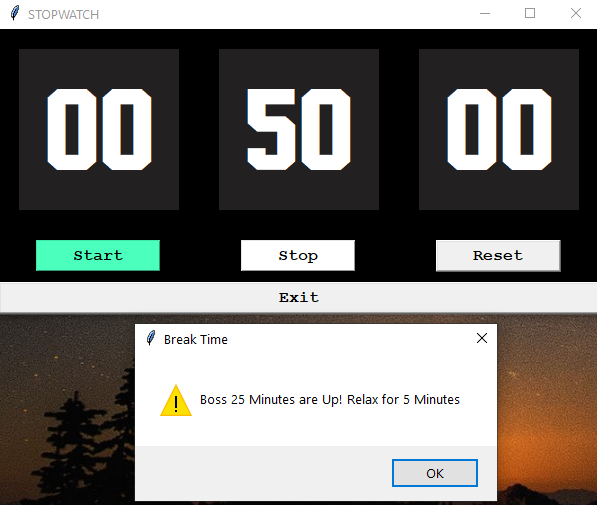
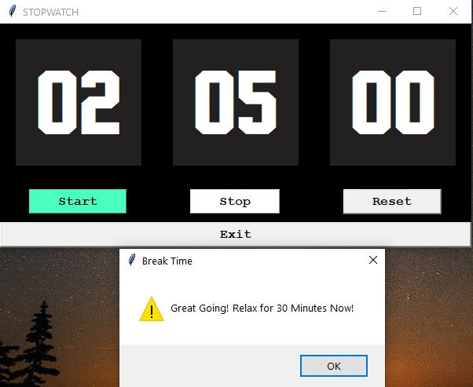
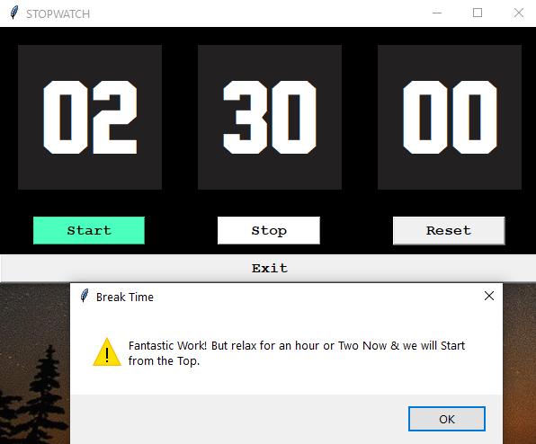

# Pomodoro StopWatch Python Widget

### :watch: with an Alert that keeps your Productivity up!

Inspired by the pomodoro Technique, I created this Python app, to **boost your productivity** which gives prompts every 25 Minutes so that you can take break for the next 5 Minutes and then continue working. This technique allows to 

> *Note: I have open-sourced this App, so that you can customize this your own way by forking from my Repo. 
   You can even convert this into an .exe file and run on any machine.*

 

**Pre-Requisites**
> Python : Install from [here](https://www.python.org/downloads/) 
> tkinter Library : `pip install tkinter`

### Key Features
+ AutoStart With VBScript  
+ > Download the Code Folder & run savemytime.vbs scipt to open the widget app.
    

+ With Keyboard & Mouse Compatibility:

       KEY     : FUNCTION
      
      <Space>  : Start & Stop Alternatively
      <Delete> : Reset
      <Escape> : Exit

   
    

+ How to Effectively Apply this Technique?
  + Widget **Prompts** you at Intervals of 25 Minutes. 
  + Take a Break for 5 Minutes for first 4 Pomodoros i.e. First 100 Minutes.
  + Take a Break for 30 Minutes after the Next Interval.
  + After Completing Last Pomodoro, Clap for yourself and take a break for an Hour or Two :smiley:
 

 &nbsp;&nbsp;&nbsp;&nbsp;&nbsp;&nbsp;      
 &nbsp;&nbsp;&nbsp;&nbsp;&nbsp;&nbsp; 

   

> This may look like a simple app which it is :wink: but it is really Powerful, and effective in Time Management. Trust me, this is an tried and tested Product. Happy Growing !!
