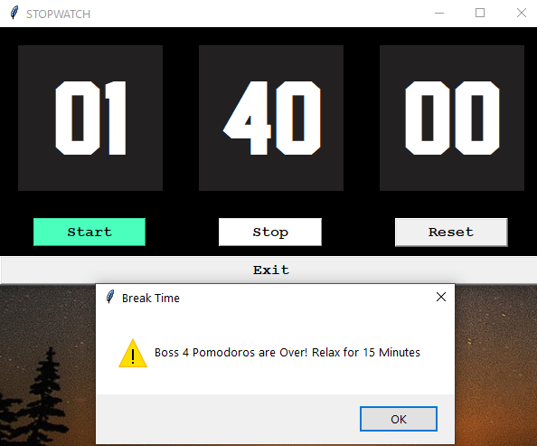
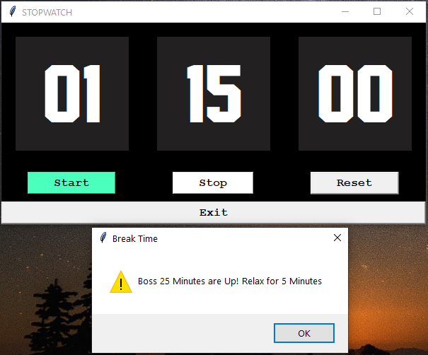

# Pomodoro StopWatch Python Widget

### :watch: with an Alert that keeps you Productivity up!

Inspired by the pomodoro Technique, I created this Python app, to **boost your productivity** which gives prompts every 25 Minutes so that you can take break for the next 5 Minutes and then continue working.

> *Note: I have open-sourced this App, so that you can customize this your own way by forking from my Repo.*

 

**Pre-Requisites**
> Python : Install from [here](https://www.python.org/downloads/) 
> tkinter Library : `pip install tkinter`

### Key Features
+ AutoStart With VBScript  
+ > Download the Code Folder & run savemytime.vbs scipt to open the widget app.
    

+ With Keyboard & Mouse Compatibility:

       KEY     : FUNCTION
      
      <Space>  : Start & Stop Alternatively
      <Delete> : Reset
      <Escape> : Exit

   
    

+  **Prompts** at 25 Minutes to give your mind a break & reset it  
  &nbsp;  &nbsp; 

> This may look like a simple app which it is :wink: but it is really Powerful, and effective in Time Management. Trust me, this is an tried and tested Product. Happy Growing !!
